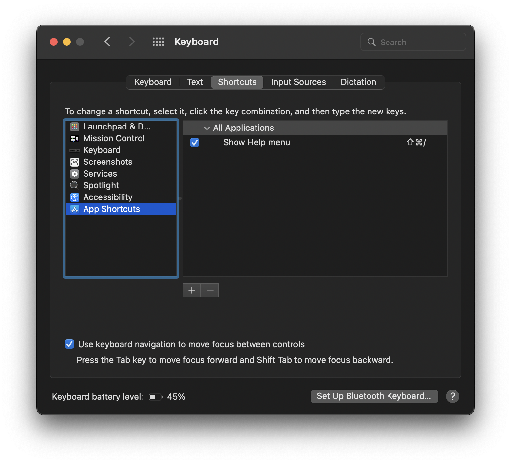
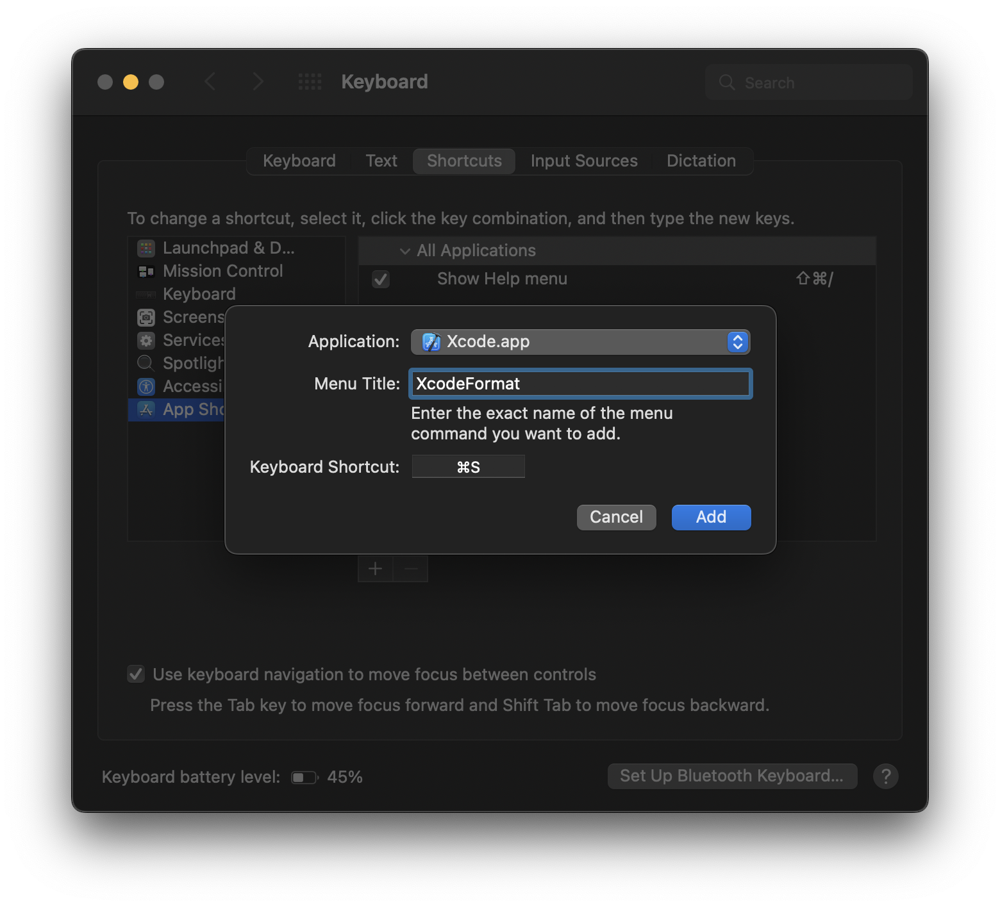
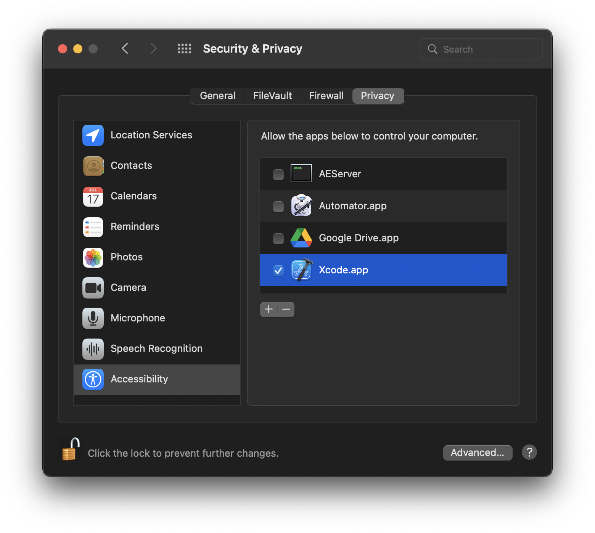
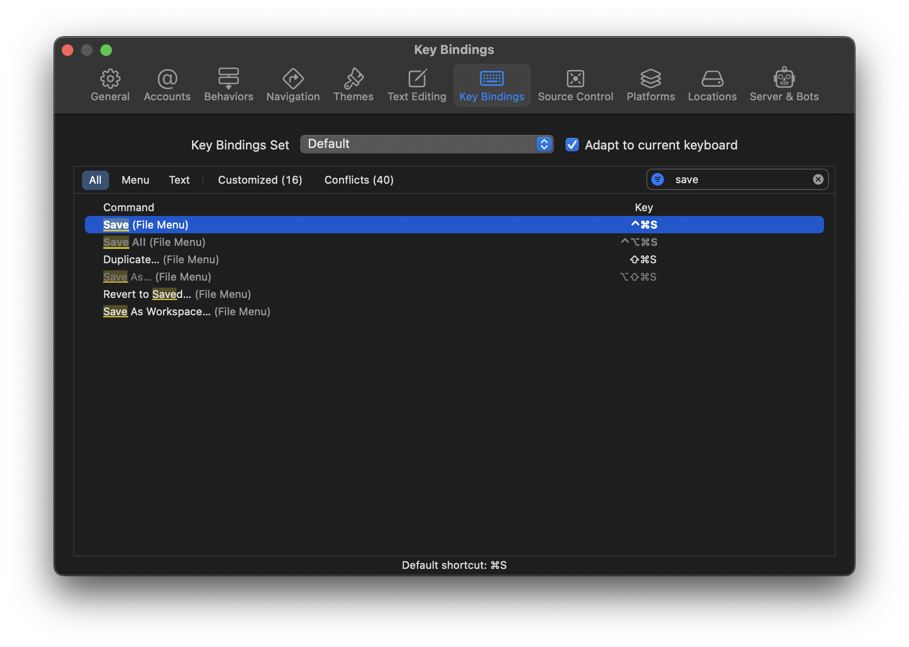
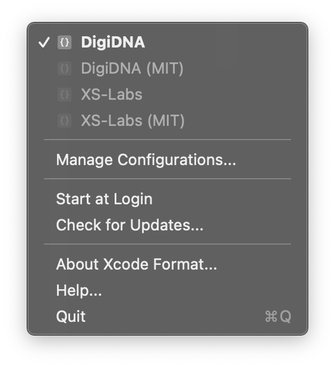

XcodeFormat
===========

  

### How to install

Quit Xcode.

Download the [latest release](https://github.com/macmade/XcodeFormat/releases/latest) and place the `.app` file in your `Applications` folder.  
Launch the application.

Open the `System Preferences`, navigate to the `Keyboard` section, and select `App Shortcuts` in the sidebar:

Click the `+` button to add a new shortcut:

Choose `Xcode` as application, type `XcodeFormat` in `Menu Title` field, and set the shortcut to `cmd-s`.

From the `System Preferences`, navigate to the `Security & Privacy` section, and select `Accessibility` in the sidebar.  
Add Xcode to the list of applications and ensure the checkbox next to it is selected.

Open Xcode, go the the `Preferences` and navigate to the `Key Bindings` tab.  
Search for `Save`, and choose a different shortcut for the save action (such as `cmd-ctrl-s`):

### How to use

From the `Xcode Format` application (menu bar app), you can create and select different configurations.  
Once a configuration is active, it will be used next time you save a file in Xcode:

It is advised to keep this application running (and set it to start at login), as it will periodically update the configuration files from the supplied URLs.

An automator workflow will run every time you use the `cmd-s` shortcut.  
The worklow will trigger the `Editor > Xcode Format Extension > Format Current File` and `File > Save` menu items.

License
-------

Project is released under the terms of the MIT License.

Repository Infos
----------------

    Owner:          Jean-David Gadina - XS-Labs
    Web:            www.xs-labs.com
    Blog:           www.noxeos.com
    Twitter:        @macmade
    GitHub:         github.com/macmade
    LinkedIn:       ch.linkedin.com/in/macmade/
    StackOverflow:  stackoverflow.com/users/182676/macmade
