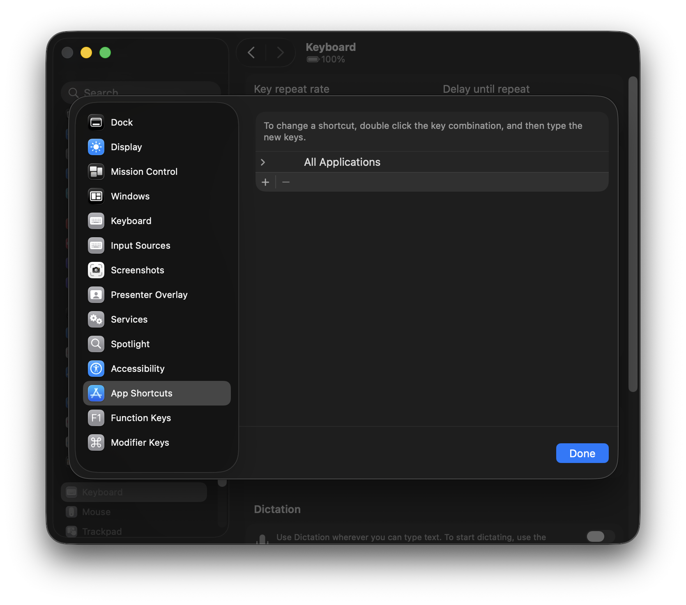
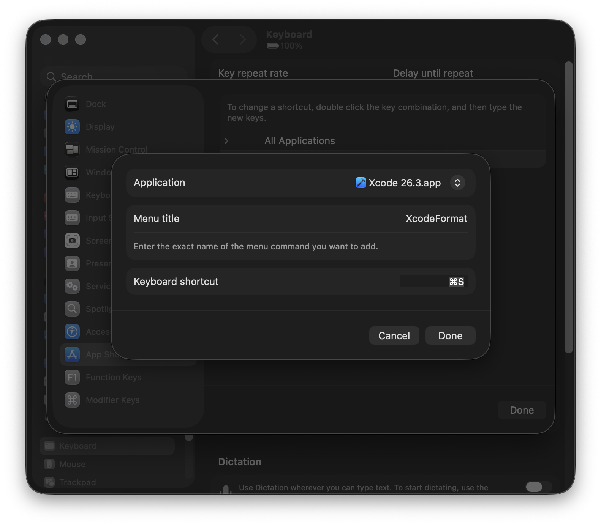
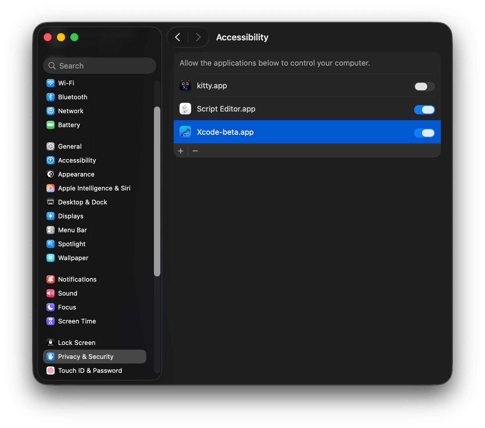
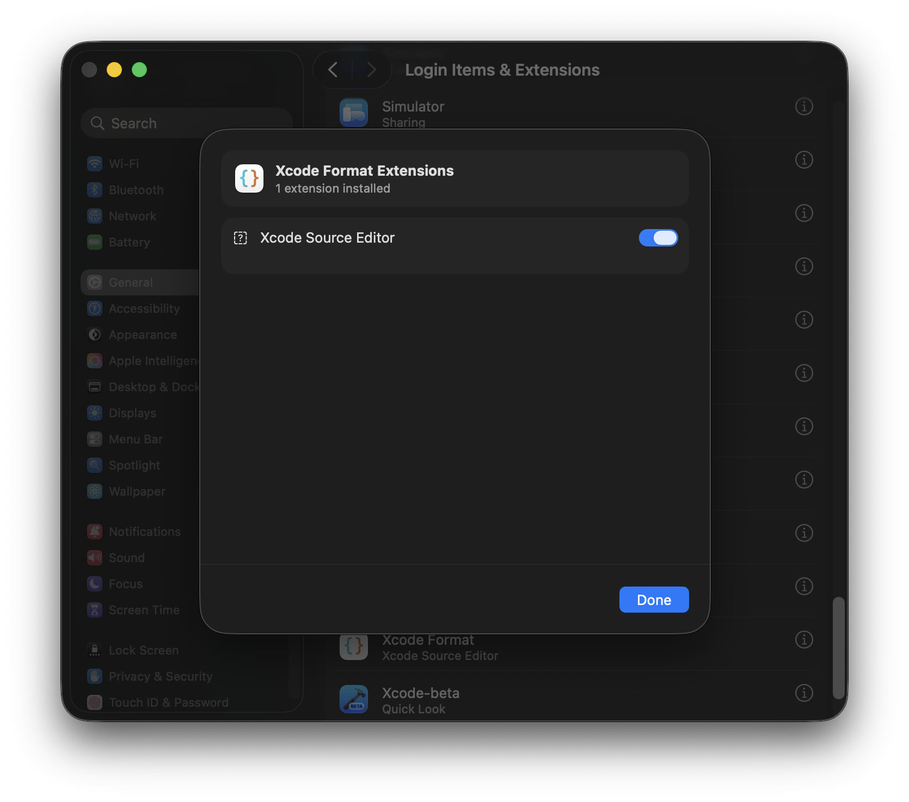
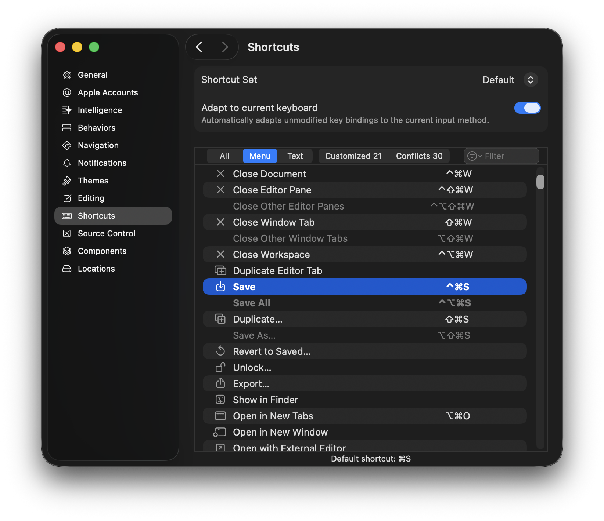
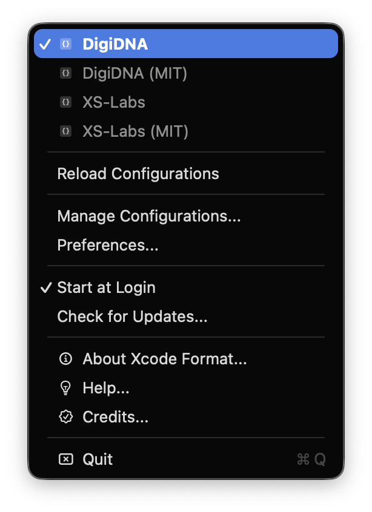

XcodeFormat
===========

[](https://github.com/macmade/XcodeFormat/actions/workflows/ci-mac.yaml)
[](https://github.com/macmade/XcodeFormat/issues)

  
[](https://twitter.com/macmade)
[](https://github.com/sponsors/macmade)

XcodeFormat automatically formats your source files when you save in Xcode.

It's a macOS menu-bar app paired with an Xcode Source Editor extension. By
rebinding `cmd-s`, every save first runs your code through a formatter and then
saves the file, so your style is enforced without any extra steps:

- **Swift** is formatted with [SwiftFormat](https://github.com/nicklockwood/SwiftFormat).
- **C, C++, Objective-C and Objective-C++** are formatted with [uncrustify](https://github.com/uncrustify/uncrustify).

Both formatters are bundled inside the app, so there's nothing else to install.

Formatting is driven by named **configurations**. Each pairs a SwiftFormat
config with an uncrustify config, and these can point to remote URLs that the
app keeps up to date in the background — handy for sharing a single house style
across a team.

The same engine is also available [from the command line](#command-line-usage),
so you can format files outside Xcode — in scripts, build phases, or editor
hooks.

### How to install

Quit Xcode.

Download the [latest release](https://github.com/macmade/XcodeFormat/releases/latest) and place the `.app` file in your `Applications` folder.  
Launch the application.

Open `System Settings`, navigate to the `Keyboard` section, and select `App Shortcuts`:



Click the `+` button to add a new shortcut:



Choose `Xcode` as application, type `XcodeFormat` in `Menu Title` field, and set the shortcut to `cmd-s`.

From `System Settings`, navigate to the `Privacy & Security` section, and select `Accessibility`.  
Add Xcode to the list of applications and ensure the checkbox next to it is selected.



From `System Settings`, ensure that `Xcode Source Editor` is enabled for the `Xcode Format` extension.



Open Xcode, go to the `Preferences` and navigate to the `Key Bindings` tab.  
Search for `Save`, and choose a different shortcut for the save action (such as `cmd-ctrl-s`):



### How to use

From the `Xcode Format` application (menu bar app), you can create and select different configurations.  
Once a configuration is active, it will be used next time you save a file in Xcode:



It is advised to keep this application running (and set it to start at login), as it will periodically update the configuration files from the supplied URLs.

An automator workflow will run every time you use the `cmd-s` shortcut.  
The workflow will trigger the `Editor > Xcode Format Extension > Format Current File` and `File > Save` menu items.

### Command-line usage

The application bundle can also be invoked directly from the command line to format files, without going through Xcode.  
This makes it possible to format files in scripts, build phases, or editor integrations.

The binary lives inside the application bundle:

```
/Applications/Xcode Format.app/Contents/MacOS/Xcode Format
```

It shares the same stored configurations as the menu-bar app, so it works whether or not the app is running (and even before it has ever been launched, using the built-in defaults).

```
OVERVIEW: Format source files using a named XcodeFormat configuration.

USAGE: XcodeFormat [--list] [--config <config>] [<files> ...]

ARGUMENTS:
  <files>                 Source files to format in place.

OPTIONS:
  -l, --list              List the available configurations.
  -c, --config <config>   Name of the configuration to use.
  -h, --help              Show help information.
```

For example, to list the available configurations:

```sh
"/Applications/Xcode Format.app/Contents/MacOS/Xcode Format" --list
```

And to format one or more files in place using a named configuration:

```sh
"/Applications/Xcode Format.app/Contents/MacOS/Xcode Format" --config MyConfig File1.swift File2.swift
```

### Using with Claude Code hooks

Because it can be driven from the command line, `Xcode Format` can be used in a [Claude Code](https://claude.com/claude-code) hook to automatically enforce formatting every time a file is written or edited.

The following `PostToolUse` hook runs `Xcode Format` after every `Write` or `Edit`, but only for source files on macOS, and only when the application is installed:

```json
{
  "hooks": {
    "PostToolUse": [
      {
        "matcher": "Write|Edit",
        "hooks": [
          {
            "type": "command",
            "statusMessage": "Formatting with Xcode Format…",
            "command": "jq -r '.tool_input.file_path // .tool_response.filePath // empty' | { read -r f; [ -n \"$f\" ] || exit 0; [ \"$(uname -s)\" = \"Darwin\" ] || exit 0; case \"$f\" in *.swift|*.c|*.h|*.m|*.mm|*.cpp|*.cc|*.cxx|*.hpp|*.hh) :;; *) exit 0;; esac; fmt=\"/Applications/Xcode Format.app/Contents/MacOS/Xcode Format\"; [ -x \"$fmt\" ] || exit 0; \"$fmt\" --config XS-Labs \"$f\"; } 2>/dev/null || true"
          }
        ]
      }
    ]
  }
}
```

Replace `XS-Labs` with the name of the configuration you want to enforce (see `--list` for the available names).

License
-------

Project is released under the terms of the MIT License.

Repository Infos
----------------

    Owner:          Jean-David Gadina - XS-Labs
    Web:            www.xs-labs.com
    Blog:           www.noxeos.com
    Twitter:        @macmade
    GitHub:         github.com/macmade
    LinkedIn:       ch.linkedin.com/in/macmade/
    StackOverflow:  stackoverflow.com/users/182676/macmade
